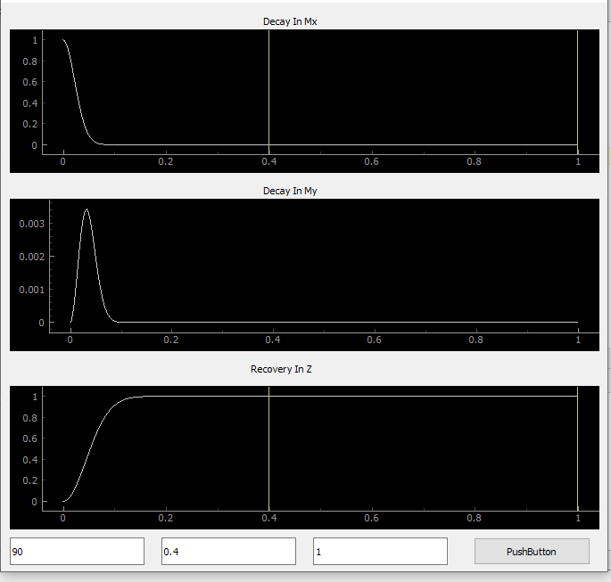
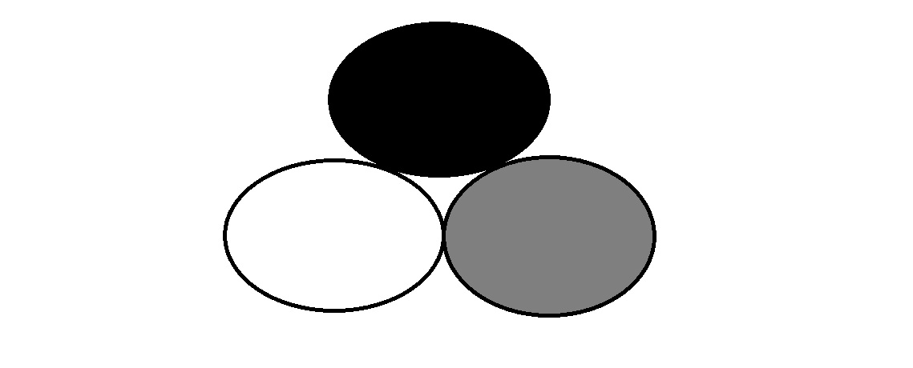
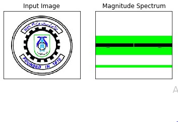
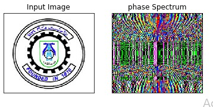
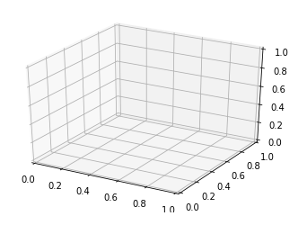
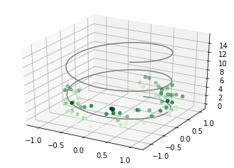

# MRI Report for Programming Task 1
## By:
* Ghada Adel Abdelaziz
* Toaa Mahmoud AbdelHakim
* Neveen Fathy
* Mostafa Tawfiq

## implementation & describtion
* Create a function that rotates the bulk magnetization vector.
```c
The sequence simply consists of 60-degree excitation pulses about the y-axis, spaced TR apart.
These functions written in python.
these functions  is parts of the main code but the source code in attached.
```
```c

    def rotationAroundYaxisMatrix(self,theta,vector):
            vector = vector.transpose()
            theta = (math.pi / 180) * theta
            R = np.matrix ([[np.cos(theta), 0, np.sin(theta)], [0, 1, 0], [-np.sin(theta), 0, np.cos(theta)]] )
            R = np.dot(R, vector)
            R = R.transpose()
            return np.matrix(R)


    def rotationAroundZaxisMatrixXY(self,TR,speed,vector,time): #time = self.time
            vector = vector.transpose()
            theta = speed * (time/ TR)
            theta = (math.pi / 180) * theta
            XY = np.matrix([[np.cos(theta),-np.sin(theta),0], [np.sin(theta), np.cos(theta),0],[0, 0, 1]])
            XY = np.dot(XY,vector)
            XY = XY.transpose()
            return np.matrix(XY) 
```
* Plot the bulk magnetization trajectory and generate a figure
representing the results.
```c
For this part we implement a gui python with pyqt5.
Files with sourse code is attached.
```
```c
def plot(self):
        self.ui.decayMx.clear()
        self.ui.decayMy.clear()
        self.ui.recoveryMz.clear()
        
        self.DecayMx = self.ui.decayMx
        self.DecayMy = self.ui.decayMy
        self.RecoveryMz = self.ui.recoveryMz


        self.theta = ((float) (self.ui.rotationAngle.text())) #5ly balk not global 
        self.Tr = ((float) (self.ui.tr.text()))
        self.Te = ((float) (self.ui.te.text()))
        

        speed =1 

        self.Mx = []
        self.My = []
        self.Mz =[]
        
        self.vector = self.rotationAroundYaxisMatrix(self.theta,self.vector)

        for i in range(len(self.time)):
            self.vector = self.rotationAroundZaxisMatrixXY(self.Tr,speed,self.vector,self.time[i])
            self.vector = self.recoveryDecayEquation(self.T1,self.T2,self.PD, self.vector,self.time[i])
            
            self.Mx = np.append(self.Mx,self.vector.item(0))
            self.My = np.append(self.My,self.vector.item(1))
            self.Mz = np.append(self.Mz,self.vector.item(2))
        
    

        self.DecayMx.plot(self.time,np.ravel(self.Mx))
        self.DecayMy.plot(self.time,np.ravel(self.My))
        self.RecoveryMz.plot(self.time,np.ravel(self.Mz))

        self.RecoveryMz.addLine(x=self.Tr)
        self.RecoveryMz.addLine(x=self.Te)
        self.DecayMx.addLine(x=self.Tr)
        self.DecayMx.addLine(x=self.Te)

        
    def createPD(self,intensity):
        return (1/255)*intensity 
        
    def createT1 (self,intensity):
        return ((6*intensity)+500)/1000

    def createT2(self,intensity):
        return ((2*intensity)+20)/1000
    def returnIntensity(self,Pd): # proton intensity vales from 0 till 1 
        return 255*Pd
    

    
    def mappingT1 (self,T1): #T1 in msec assumption
        return (T1-500)/6

    def mappingT2 (self,T2):  #T1 in msec assumption
        return (T2-20)/2


    def recoveryDecayEquation(self,T1,T2,PD,vector,time):
            vector = vector.transpose()
            Decay =np.matrix([[np.exp(-time/T2),0,0],[0,np.exp(-time/T2),0],[0,0,np.exp(-time/T1)]])
            Decay = np.dot(Decay,vector)
        
            Rec= np.dot(np.matrix([[0,0,(1-(np.exp(-time/T1)))]]),PD)
            Rec = Rec.transpose()
            Decay = np.matrix(Decay)
            Rec =  np.matrix(Rec)    
        
            RD  = Decay + Rec
            RD = RD.transpose()
            return RD

```


* Load images; show the figures. Calculate the Fourier transform of
the images and plot it in the K-space domain.
```c
* We made an image in a paint with three circles white grey and black to make the picture with different intensity then we get fourier transform using numby..Numby has FFT package to do this... np.fft.fft2() provides us the frequency transform which eill be a complex array
As zero frequency component will be at top left corner ..we bring it to center  by shift the result by N/2 in both directions.... this is simply done by the function np.fft.fftshift()
Then we get the magnitude by np.abs
And phase by np.angle
```
```c
import cv2
import numpy as np
from matplotlib import pyplot as plt

img = cv2.imread('C:\\Users\\mas\Desktop\\circle.jpg')
f = np.fft.fft2(img)
fshift = np.fft.fftshift(f)
magnitude_spectrum = np.abs(fshift)

plt.subplot(121),plt.imshow(img, cmap = 'gray')
plt.title('Input Image'), plt.xticks([]), plt.yticks([])
plt.subplot(122),plt.imshow(magnitude_spectrum, cmap = 'gray')
plt.title('Magnitude Spectrum'), plt.xticks([]), plt.yticks([])
plt.show()
```






* Define a function that simulates the uniformity effect; where its
effect is imposed in the axial (z), but no radial (x or y) dependence
on the magnetic field strength. Make a plot of Bz(z).
```c
that implementation describe the nonuniformity effect of static magnetic fields along a part of human body inside the MRI machine
the implemented code runs in Jupyter notbook as shown below:
```
```c
from mpl_toolkits import mplot3d
%matplotlib inline
import numpy as np
import matplotlib.pyplot as plt
```
```c
fig = plt.figure()
ax = plt.axes(projection='3d')
```


```c
ax = plt.axes(projection='3d')

#Data for a three-dimensional line
zline = np.linspace(0, 15, 1000)
xline = np.sin(zline)
yline = np.cos(zline)
ax.plot3D(xline, yline, zline, 'gray')

#Data for three-dimensional scattered points
zdata = 5 * np.random.random(100)
xdata = np.sin(zdata) + 0.1 * np.random.randn(100)
ydata = np.cos(zdata) + 0.1 * np.random.randn(100)
ax.scatter3D(xdata, ydata, zdata, c=zdata, cmap='Greens');
```


```c